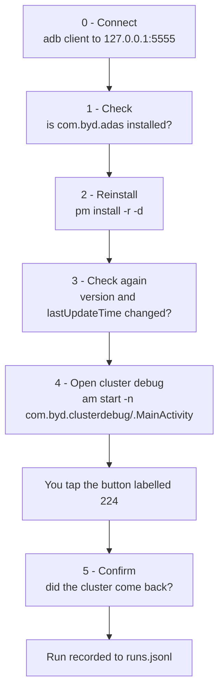
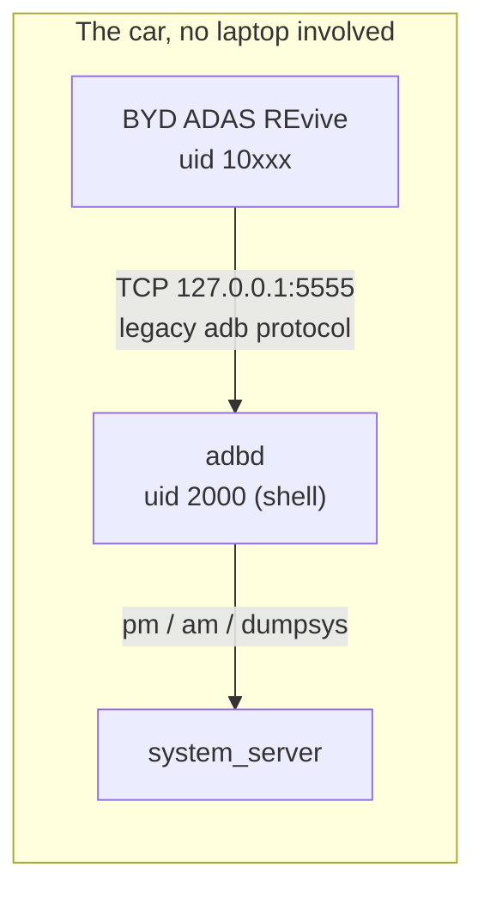

# BYD ADAS REvive

An on-device wizard for BYD head units running DiLink 5 (Android 12) that walks the
whole "my ADAS app got replaced and the cluster went blank" repair in one place:
check the package, reinstall the APK, check it again, fire the cluster debug window,
and record whether the cluster actually came back.

Everything runs on the car. No laptop, no USB cable, no root.


---

## Why this exists

On some Chinese-spec cars `com.byd.adas` gets superseded by the stock ADAS package
under a different name, and the instrument cluster stops showing the ADAS view. The
fix is known but tedious: find an adb shell, reinstall the APK by hand, launch a
hidden debug activity, tap one button in it, then go look at the cluster. This app is
that sequence with the guesswork removed and a log of what happened.

## Tested on

| | |
|---|---|
| Car | BYD Song Plus 2025, Chinese spec, smart driving edition |
| System | DiLink 5, Android 12 |
| ABI | armeabi-v7a |
| Screen | 1920x1080, landscape |
| Root | not required, not used |

If you run it on something else, please open an issue with what happened. The console
pane copies to clipboard in one tap.

## Before you start

You need three things:

1. **adb access on the car.** Developer options enabled and an adb client or shell app
   already working on the head unit.
2. **`adb tcpip 5555` run since the last reboot.** This is what the app connects to.
   See [How the shell channel works](#how-the-shell-channel-works).
3. **The `com.byd.adas` APK in `/sdcard/Download`.** It must be signed with the same
   key as the copy already on your car, otherwise the install is refused. An APK you
   pulled off a BYD head unit with `adb pull` will match. One rebuilt or re-signed by
   someone else will not.

## The flow



### 0. Connect the shell channel

Tap **Connect**. The first time, the car shows an "Allow debugging?" prompt. Tick
**Always allow** so it does not ask again.


The pill in the top right turns green and reads `shell ready` once the handshake is
done. If it says `shell failed`, the fix is almost always step 2 in
[Before you start](#before-you-start) - the app gives you a **Copy** button for the
command.


### 1. Is the package there?

Two views, because they disagree in a way that matters:

- **PackageManager** reports what a normal app can see: version, enabled state, system
  flag, install path, first install and last update times.
- **The shell view** (`pm list packages -u -f` and `dumpsys package`) also sees a
  package that was *uninstalled for this user* while its APK is still sitting on
  `/system`. That is a different problem with a different fix, and only the shell can
  tell you which one you have.


**All packages** expands into a filterable list of everything installed, which is
handy for finding the package name of whatever superseded your ADAS app.

### 2. Reinstall the APK

Two ways to pick the file:

- **Browse /sdcard/Download** - lists APKs over the shell channel. No storage
  permission needed and the path goes straight to `pm`. Use this one.
- **Pick with Files app** - the standard Android document picker, for an APK stored
  somewhere else. The bytes get staged into the app's own external files directory
  first, which shell may or may not be able to read on your build. If it cannot, the
  install output says so and you should use the Downloads path instead.


The install runs as `pm install -r -d`, as shell:

- `-r` reinstalls over the existing copy,
- `-d` allows a downgrade, which matters because an APK pulled from a newer firmware
  can carry a *lower* version code than the stock package on your car,
- running as shell means no "install unknown apps" permission and no Play Protect
  dialog.


### 3. Check again

`Success` from `pm` is not by itself proof that a fresh copy landed. The version code
and `lastUpdateTime` are. The app compares them against what it recorded in step 1 and
tells you plainly whether anything changed.


### 4. Open cluster debug, then tap 224

```
am start -n com.byd.clusterdebug/com.byd.clusterdebug.MainActivity
```

**Run via shell** is the reliable path: it works whether or not that activity is
exported. **Direct intent** is a fallback that only works on an exported activity, for
when you have no shell at all. **Copy command** hands you the string for your own adb
shell app.

The cluster debug window opens on top of REvive. Tap the button labelled **224**, then
come back.


### 5. Did the cluster come back?

This step is an acknowledgement, not a measurement, and that is deliberate. A normal
app on Android 12 **cannot** observe whether ADAS is functioning: `getRunningAppProcesses()`
returns only the caller's own process since Android 5, and `READ_LOGS` is a
signature-level permission. The cluster is the only real evidence, and you are the one
looking at it.

What the app *can* prove, and does: the package is installed, its enabled state, its
version code, that `lastUpdateTime` moved, and - over the shell channel - whether a
process named `com.byd.adas` currently exists. That last one is a hint rather than a
verdict: a service running under a different process name will not match, so "no
running process" next to a working cluster is a false negative, which is why it shows
as a warning and not a failure.


Your answer is written to `runs.jsonl` in the app's private storage, next to the
install output, both version snapshots and the launch result. **Copy run history**
puts the whole file on the clipboard - that is the thing worth pasting into a forum
thread when you are comparing a run that worked against one that did not.


---

## How the shell channel works

The app needs shell-level privilege for three things: `pm install` without an
unknown-sources prompt, `am start` on a possibly non-exported activity, and `dumpsys` /
`pidof` for the checks. An Android app cannot run adb commands - it can only run a
shell as its own unprivileged uid. So the app becomes an **adb client** instead and
connects to the car's own adb daemon over loopback.



Android 11 and up put wireless debugging behind TLS on a rotating port, and that port
only accepts a client certificate already trusted through a SPAKE2 pairing handshake.
Implementing that in-app means bundling a native crypto library or shipping the real
`adb` binary as a `.so`. Both are large, fragile lifts on a custom head unit build.

`adb tcpip 5555` restarts adbd in the **legacy** TCP mode instead, which uses plain
RSA authentication and the familiar "Allow debugging?" dialog. That is a few hundred
lines of Kotlin with no native code and no pairing flow, which is what this app
implements ([`adb/`](app/src/main/java/com/definitecoding/bydadasrevive/adb)).

The cost is that `adb tcpip 5555` has to be live. Worth trying once:

```sh
setprop persist.adb.tcp.port 5555
```

If that property survives a reboot on your build, adbd listens on 5555 at every boot
and the app is self-sufficient from then on. If it does not, you run `adb tcpip 5555`
once per boot from your existing adb shell app.

## Troubleshooting

| What you see | What it means |
|---|---|
| `shell failed` / connection refused | Nothing is listening on 5555. Run `adb tcpip 5555`. |
| `adbd is in wireless-debugging TLS mode` | adbd is on the TLS port. `adb tcpip 5555` switches it to legacy mode. |
| `The car did not accept this app's adb key` | The "Allow debugging?" prompt was missed, dismissed, or denied. Tap Connect again and watch the car screen. |
| `INSTALL_FAILED_UPDATE_INCOMPATIBLE` | Your APK's signature does not match the copy on the car. Get one pulled from a BYD head unit. |
| `INSTALL_FAILED_VERSION_DOWNGRADE` | Should not happen with `-d`. Report it with the console output. |
| `Permission Denial ... not exported` on step 4 | You used **Direct intent** without a shell. Use **Run via shell**. |
| Install output mentions the staged path | Shell could not read the staging directory on your build. Put the APK in `/sdcard/Download` and use **Browse**. |

## Build from source

Nothing to install locally - CI builds and signs it. Push a branch and grab the APK
from the run's artifacts, or push a `v*` tag and it is attached to a GitHub release.

To build a signed release yourself, set three repository secrets:

| Secret | Value |
|---|---|
| `KEYSTORE_B64` | base64 of a PKCS12 keystore |
| `KEYSTORE_PASS` | its password |
| `KEY_ALIAS` | the key alias inside it |

```sh
openssl req -x509 -newkey rsa:2048 -sha256 -days 10950 -nodes \
  -keyout key.pem -out cert.pem -subj "/CN=BYD ADAS REvive"
openssl pkcs12 -export -inkey key.pem -in cert.pem -name revive -out revive.p12
openssl base64 -A -in revive.p12   # this goes in KEYSTORE_B64
```

Without those secrets the build still succeeds, signed with the debug key. Keep your
keystore: a different signature means everyone who installed the old build has to
uninstall before they can update.

Locally, if you do have a JDK 17 and the Android SDK: `gradle assembleRelease`. No
Gradle wrapper is committed, CI provisions Gradle 8.7.

## Caution

This is an unofficial community tool. It is not affiliated with, endorsed by, or
supported by BYD.

It reinstalls a driver-assistance app and opens a factory debug window on your car.
Do all of it parked. After a run, treat ADAS as unverified until you have confirmed
its behaviour yourself in safe conditions - a green line in this app means a package
is installed, not that a safety system is calibrated and working. You are responsible
for what you install on your own vehicle.

## Screenshots wanted

Drop files with these exact names into `docs/images/` and they appear above:

- [ ] `hero.png` - the whole app on the head unit, landscape
- [ ] `step0-connect.png` - step 0 with the green `shell ready` pill
- [ ] `step0-allow-debugging.png` - the car's "Allow debugging?" dialog
- [ ] `step1-package-check.png` - step 1 showing the package facts
- [ ] `step2-apk-list.png` - the APK list from `/sdcard/Download`
- [ ] `step2-install-success.png` - a successful install
- [ ] `step3-recheck.png` - step 3 with the changed/unchanged verdict
- [ ] `step4-clusterdebug-224.png` - the cluster debug window, 224 button visible
- [ ] `step5-confirm.png` - step 5 after confirming
- [ ] `cluster-before-after.png` - the cluster, broken and then working

## License

GPL-3.0. See [LICENSE](LICENSE).
